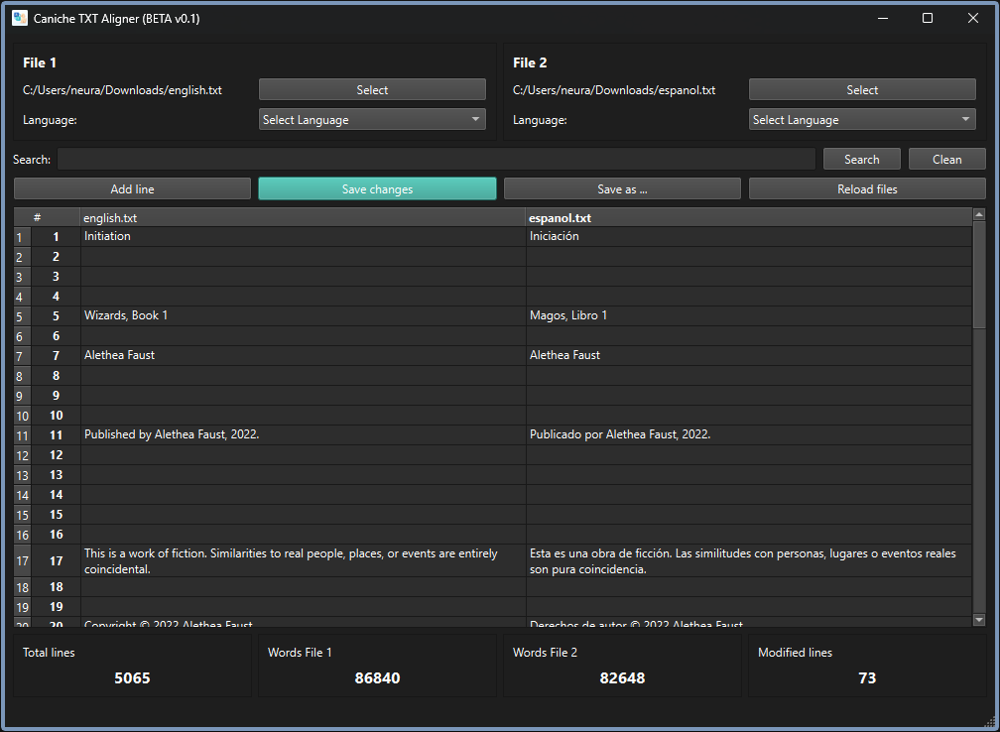

<div align="center">
  
</div>

<h1 align="center">Caniche TXT Aligner</h1>

<div align="center">
  Caniche TXT Aligner is a desktop application developed in Python with PyQt6 that allows you to edit and align text files in different languages. The application is designed to work with pairs of text files, facilitating line-by-line comparison and editing (ideal for translation).

⚠️ **NOTE**: This application is currently in BETA version (v0.1). Although the main functionality is stable, there may be some issues or limitations.
</div>
<br>
<div align="center">
  
</div>

## Main Features

- Load and edit two text files simultaneously
- Support for multiple languages (file labeling)
- Direct editing of original files
- On-demand loading to improve performance with large files
- Text search across both files
- Real-time statistics (total lines, words, modified lines)
- Functions to move, delete and add lines
- Save changes to original files or as new files

## Requirements

- Python 3.x
- PyQt6

## Installation

### Option 1: Download the executable (Windows)

For Windows users, a ready-to-use executable is available in the [Releases](https://github.com/neura-neura/caniche-txt-aligner/releases) section of this repository. Simply download the latest .exe file and run it without any installation required.

### Option 2: Run from source

1. Clone this repository:
```
git clone https://github.com/neura-neura/caniche-txt-aligner.git
cd caniche-txt-aligner
```

2. Install dependencies:
```
pip install PyQt6
```

3. Run the application:
```
python script.py
```

## Creating an Executable

To create a standalone executable file, you can use PyInstaller:

```
pip install pyinstaller
pyinstaller --onefile --windowed --icon=assets/img/icon.ico --add-data "assets/img/icon.ico;assets/img" script.py
```

## Basic Usage

1. Start the application
2. Use the "Select" buttons to load the text files you want to compare
3. Optionally, select the language of each file from the dropdown menus
4. Edit the content of the files directly in the table
5. Use the search functions to find specific text
6. Use the context menu (right-click) to add, move or delete lines
7. Save changes using "Save changes" (overwrites original files) or "Save as..." (creates new files)

## Development Status

This BETA version (v0.1) has been tested on Windows 11 64-bit. The main function of text alignment and editing works correctly, although there may be some limitations or unexpected behaviors under certain conditions.

### Known Issues

- Performance may decrease with extremely large files
- Occasional delays when loading or saving large files
- The interface may need adjustments on different screen resolutions

## Contributions

Contributions are welcome. If you find any issues or have suggestions to improve the application, please open an issue or send a pull request.

## License

This project is licensed under the MIT License. See the [LICENSE](./LICENSE) file for details.
